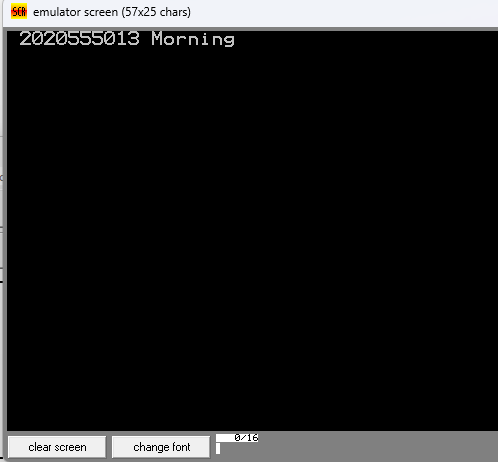

# Project Work which will replace the Final Exam

Write an assembly code which will create similar outputs described and shown below.

1- Store your student number in memory adresses starting from 0100:2000h. Every number(char) will be stored in one byte address. (Hint DB)  

2- Move your student number 0100:2000h memory array starting from to 0200:2000h memory address. (MOVSB)  

3- Display your student number and decide education status either 'Morning' or 'Evening' education. Print to the screen. (Hint: CMP, INT)  

Update this README.md file with your own screenshots and explanations. Do not upload new README.md file.   
Update final.asm file with your own code.  
**Do not cheat. Do not copy. Do not share your work with your friends.**

Use git commands to upload your work to your own repository. Do not use file upload option on the web interface of the github.

# CEN214 - Microprocessors Lab. Final Exam solutions
## 1. Step
Insert your screenshot here

## 2. Step
Insert your screenshot here

## 3. Step
Insert your screenshot here

